# PFM AI Financial Manager Architecture Overview

This document outlines the three-tier system architecture implemented in the PFM AI application, mapping frontend, backend, and database components to their respective implementation files in this repository.

```mermaid
graph TD
    subgraph Frontend ["Frontend (React 18.2 / Vite)"]
        A[Dark-themed Financial Dashboard]
        B[Manual Transaction Entry Forms]
        C[Web Speech API - en-IN locale]
        D[Persistent WebSocket Client]
        E[State-driven Instant Re-rendering]
    end

    subgraph Backend ["Backend (FastAPI / Python 3.11)"]
        F[8 Core API Surface Groups]
        G[WebSocket Connection Manager]
        H[ML Categorization Inference]
        I[Budget & Savings Goals API]
        J[Gamification State Engine]
    end

    subgraph Database ["Database (PostgreSQL 17)"]
        K[SQLAlchemy ORM - 8+ Entity Tables]
        L[Users, Transactions, Budgets]
        M[Savings Goals, Categories]
        N[Gamification Badges & Scores]
        O[Prediction Cache per Category]
    end

    %% Connections
    A & B & C & D & E <-->|WebSocket / REST| F & G & H & I & J
    F & G & H & I & J <-->|SQLAlchemy ORM| K & L & M & N & O
    
    style Frontend fill:#1e1e2e,stroke:#6366f1,stroke-width:2px,color:#fff
    style Backend fill:#111827,stroke:#22c55e,stroke-width:2px,color:#fff
    style Database fill:#0f172a,stroke:#8b5cf6,stroke-width:2px,color:#fff
```

---

## 🏛️<!-- PFM AI Financial Manager Architecture Documentation -->
## Architecture Overview

### 1. Frontend Layer ([React 18.2 / Vite](file:///c:/Users/HP/Downloads/pfm-app-win/pfm-app-win/frontend/package.json))
*   **Dark-themed financial dashboard**: Implemented in [DashboardPage.jsx](file:///c:/Users/HP/Downloads/pfm-app-win/pfm-app-win/frontend/src/pages/DashboardPage.jsx) using a dark Tailwind color theme.
*   **Manual transaction entry forms**: Located in [TransactionsPage.jsx](file:///c:/Users/HP/Downloads/pfm-app-win/pfm-app-win/frontend/src/pages/TransactionsPage.jsx) with the quick debit form and full transaction adder.
*   **Web Speech API (en-IN locale)**: Located in [VoicePage.jsx](file:///c:/Users/HP/Downloads/pfm-app-win/pfm-app-win/frontend/src/pages/VoicePage.jsx#L45) matching Indian English patterns for hands-free entry.
*   **Persistent WebSocket client**: Implemented inside [Layout.jsx](file:///c:/Users/HP/Downloads/pfm-app-win/pfm-app-win/frontend/src/components/Layout.jsx#L42-L113) with exponential backoff connection recovery.
*   **State-driven instant re-rendering**: Configured using custom event listeners and the custom hook [useRealTimeTransactions.js](file:///c:/Users/HP/Downloads/pfm-app-win/pfm-app-win/frontend/src/hooks/useRealTimeTransactions.js).

### 2. Backend Layer ([FastAPI / Python 3.11](file:///c:/Users/HP/Downloads/pfm-app-win/pfm-app-win/backend/requirements.txt))
*   **8 core API surface groups**: Mapped to routers registered in [main.py](file:///c:/Users/HP/Downloads/pfm-app-win/pfm-app-win/backend/app/main.py#L110-L133) (Authentication, Accounts, Transactions, Budgets, Goals, Predictions, Alerts, and WebSockets).
*   **WebSocket connection manager**: Handled by the `ConnectionManager` class in [notifications_api.py](file:///c:/Users/HP/Downloads/pfm-app-win/pfm-app-win/backend/app/api/notifications_api.py#L11-L30).
*   **ML categorization inference**: Handled by a 3-tier fallback categorizer in [categorizer.py](file:///c:/Users/HP/Downloads/pfm-app-win/pfm-app-win/backend/app/ai/categorizer.py). See details in [transaction_categorization.md](file:///c:/Users/HP/Downloads/pfm-app-win/pfm-app-win/docs/transaction_categorization.md).
*   **Budget & savings goals API**: Handled in [budgets.py](file:///c:/Users/HP/Downloads/pfm-app-win/pfm-app-win/backend/app/api/budgets.py) and [savings_strategies.py](file:///c:/Users/HP/Downloads/pfm-app-win/pfm-app-win/backend/app/api/savings_strategies.py) (see automated rules in [safe_to_save_rules.md](file:///c:/Users/HP/Downloads/pfm-app-win/pfm-app-win/docs/safe_to_save_rules.md)).
*   **Gamification state engine**: Mapped to points, streak logic, and badges in [gamification.py](file:///c:/Users/HP/Downloads/pfm-app-win/pfm-app-win/backend/app/api/gamification.py).

### 3. Database Layer ([PostgreSQL 17](file:///c:/Users/HP/Downloads/pfm-app-win/pfm-app-win/docker-compose.yml))
*   **SQLAlchemy ORM**: Mapped to backend models in the [models](file:///c:/Users/HP/Downloads/pfm-app-win/pfm-app-win/backend/app/models) directory.
*   **8+ Entity Tables**:
    *   `users` (User credentials, income, profiles)
    *   `transactions` (Relational transaction items, types, AI categories, coordinates)
    *   `budgets` (Category limit trackers)
    *   `savings_goals` (Milestone progress trackers)
    *   `alerts` & `notifications` (Real-time and persistent log alerts)
    *   `recurring_transactions` (Automation schedules)
    *   `forecasts` (Prediction cache per category. See specs in [predictive_forecasting.md](file:///c:/Users/HP/Downloads/pfm-app-win/pfm-app-win/docs/predictive_forecasting.md))
    *   `badges` & `challenges` (Gamification metrics)

---

## ⚡ Deployment & Infrastructure Baner
*   **Protocol**: REST for standard requests; WebSockets for real-time transaction ingestion and push alerts.
*   **Execution Profile**: **CPU-only inference** (no GPU required) for scikit-learn Naive Bayes, Linear Regression, and Facebook Prophet forecasting models, enabling easy hosting on lightweight, cost-effective servers.

