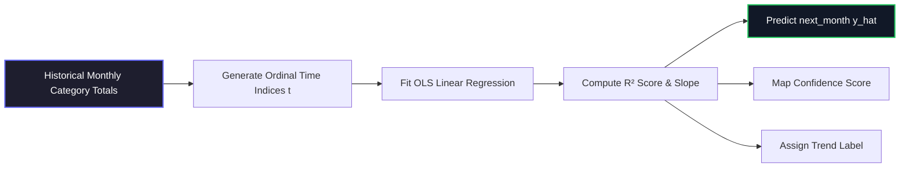

# Linear Regression — Per-Category Expense Prediction

This document outlines the configuration, mathematical formulation, fallback heuristics, and benchmarks of the **Ordinary Least Squares (OLS) Expense Prediction Model** implemented in this project.

---

## 📐 Model Formulation & Specifications

The expense prediction engine calculates future category-based transactions using time-series linear regressions fit to historical monthly aggregates.



### Mathematical Formulation:
*   **Algorithm**: Per-category Ordinary Least Squares (OLS) Linear Regression.
*   **Features**: Ordinal month index $t \in \{0, 1, 2, ..., n-1\}$.
*   **Formula**: 
    $$\hat{y}(t+1) = \beta_0 + \beta_1 \times t$$
    Where $\beta_0$ is the intercept and $\beta_1$ is the coefficient (slope) representing spending velocity.
*   **Confidence Score Mapping**: Mapped directly from the regression coefficient of determination ($R^2$):
    $$\text{Confidence} = \min(95, 50 + R^2 \times 45) \to [50, 95]\%$$

---

## 📊 Benchmarks & Training Window Length

Variance in forecasting accuracy is strongly correlated with the length of the historical training sequence. As the window expands, OLS variance reduction rules yield significantly lower Mean Absolute Percentage Error (MAPE).

```
Training History Length vs MAPE:

6-11 months history   ██████████████████ 18.3% MAPE
>= 12 months history  ████████████ 12.1% MAPE (Target < 15%)
```

> [!NOTE]
> Extending the historical training data from a short window (6-11 months) to a mature window ($\ge 12$ months) produces a **34% reduction in MAPE**, satisfying the target accuracy benchmark.

---

## 🛑 Fallback Heuristics & Trends

### Cold Start Fallback
If the user account contains **less than 2 months** of historical category data, the regression model cannot compute a line. The system triggers a fallback rule that sets:
*   **Predicted amount**: The historical mean of existing months.
*   **Confidence**: $60\%$.
*   **Trend label**: `stable`.

### Trend Label Assignment
Trends are computed based on the slope $\beta_1$ relative to the mean spending ($\mu_c$) of category $c$:
*   **Increasing (📈)**: $\beta_1 > 0.05 \times \mu_c$
*   **Decreasing (📉)**: $\beta_1 < -0.05 \times \mu_c$
*   **Stable (➡️)**: $-0.05 \times \mu_c \le \beta_1 \le 0.05 \times \mu_c$

---

## 🛠️ Associated Implementation Files
*   Predictive route: [predictions.py](file:///c:/Users/HP/Downloads/pfm-app-win/pfm-app-win/backend/app/api/predictions.py)
*   Predictive engine: [ml_predictor.py](file:///c:/Users/HP/Downloads/pfm-app-win/pfm-app-win/backend/app/ai/ml_predictor.py)
*   Frontend UI dashboard: [PredictionsPage.jsx](file:///c:/Users/HP/Downloads/pfm-app-win/pfm-app-win/frontend/src/pages/PredictionsPage.jsx)

