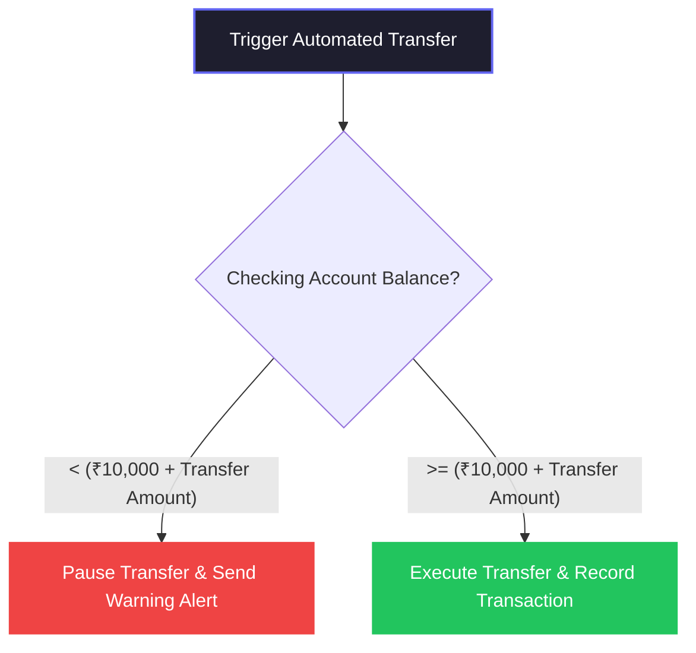

# AI Savings Safety Rules (Safe-to-Save Engine)

This document details the deterministic cash-flow safety thresholds and liquidity guardrails (the "Safe-to-Save" engine rules) implemented in the automated savings strategy engine of this project.

---

## 🛡️ "Safe-to-Save" Safety Thresholds

To prevent automation from overdrafting or depleting immediate liquidity in checking accounts, the system applies safety checks before executing any strategy.

### 1. Hard Floor Safety Threshold (₹10,000)
*   **Rule**: Automated strategy transfers are paused immediately if the source checking account balance is lower than the **₹10,000 threshold** plus the planned transfer amount:
    $$\text{Account Balance} < 10,000 + \text{Transfer Amount}$$
*   **Action**: 
    1.  Pauses the specific transfer plan status.
    2.  Sends an in-app `warning` notification to the user: *“Auto-save transfer of ₹X to 'Y' paused to prevent low checking balance...”*

---

## 🤖 Personalized Cash Flow Recommendations

The system continuously audits total checking account balances to suggest contribution adjustments for active savings goals:

### Case A: High Liquidity Boost (Balance > ₹45,000)
*   **Heuristic**: Suggests increasing monthly contributions to reach milestones faster.
*   **Proposed Adjustment**: Adds **+20%** to the monthly goal target (rounded to the nearest ₹100, min increment of ₹500).
*   **Message**: *“Cash flow audit shows healthy checking balance (₹X). We recommend increasing monthly contribution for 'Goal' by ₹Y to reach the target faster.”*

### Case B: Low Liquidity Cushion (Balance < ₹15,000)
*   **Heuristic**: Prioritizes cash reserves over savings goals.
*   **Proposed Adjustment**: Recommends lowering the contribution to safeguard short-term liquidity.
*   **Message**: *“Checking balance is low (₹X). We recommend lowering monthly contribution for 'Goal' temporarily to protect immediate liquidity.”*

### Case C: Stable Cash Flow
*   **Heuristic**: If balance is between ₹15,000 and ₹45,000, suggests keeping contribution levels unchanged.
*   **Message**: *“Cash flow is stable. Keep automated transfers running at current rates.”*

---

## 🛠️ Associated Implementation Files
*   Strategy API endpoints: [savings_strategies.py](file:///c:/Users/HP/Downloads/pfm-app-win/pfm-app-win/backend/app/api/savings_strategies.py)
*   Business rules engine: [savings_service.py](file:///c:/Users/HP/Downloads/pfm-app-win/pfm-app-win/backend/app/services/savings_service.py)
*   Savings UI Page: [GoalsPage.jsx](file:///c:/Users/HP/Downloads/pfm-app-win/pfm-app-win/frontend/src/pages/GoalsPage.jsx)

